# 🏥 HMS — Hospital Management System

A production-grade, multi-tenant, web-only Hospital Management System with integrated Pharmacy, Laboratory, and EMR modules.

---

## 📸 System Showcase

> [!NOTE]
> All screenshots below are from the live system.

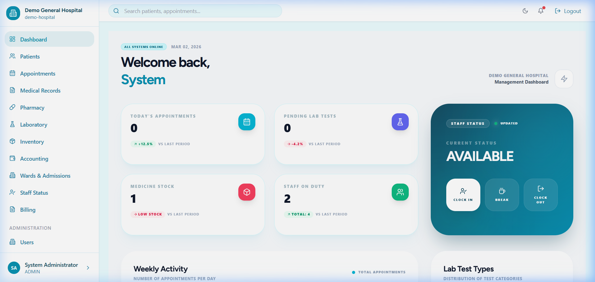
*Modern, high-performance management dashboard with real-time stats.*

---

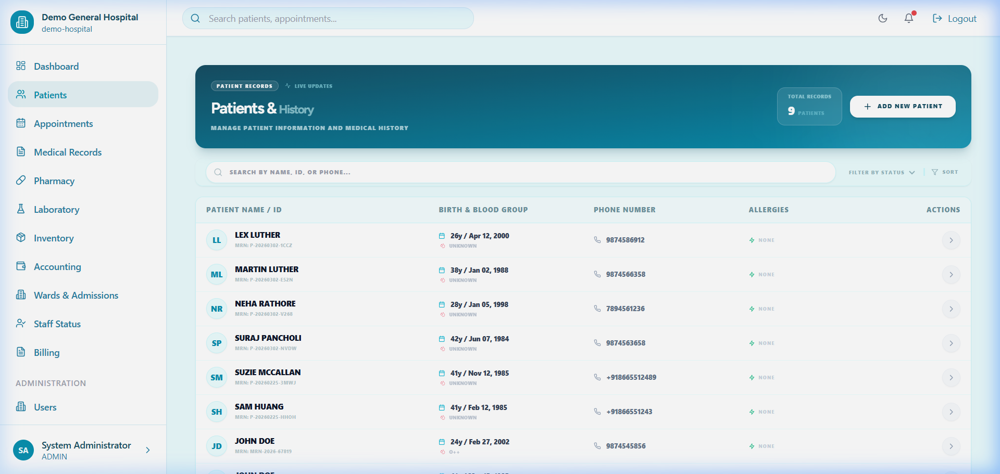
*Comprehensive Patient Records and MRN tracking.*

---

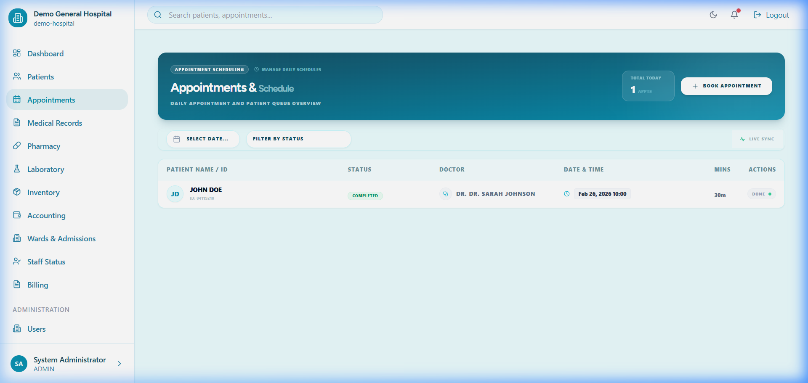
*Advanced appointment scheduling with conflict detection.*

---

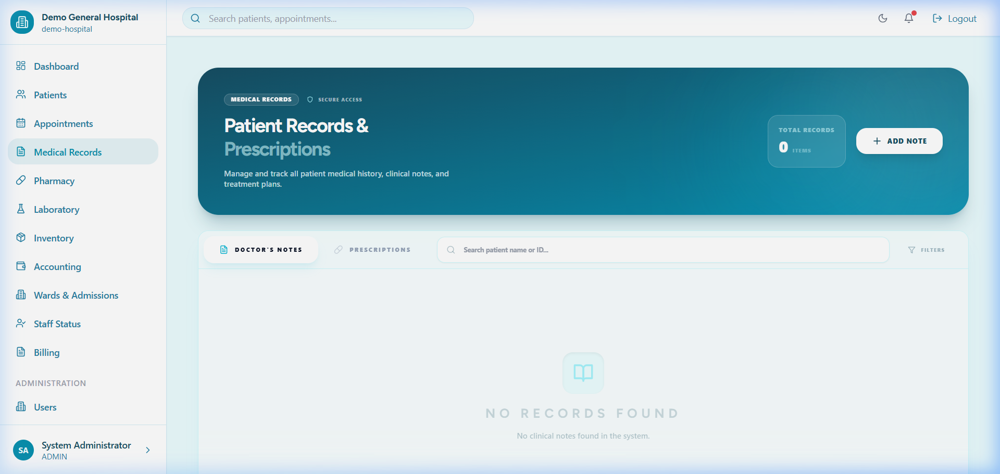
*Detailed Electronic Medical Records and SOAP notes.*

---

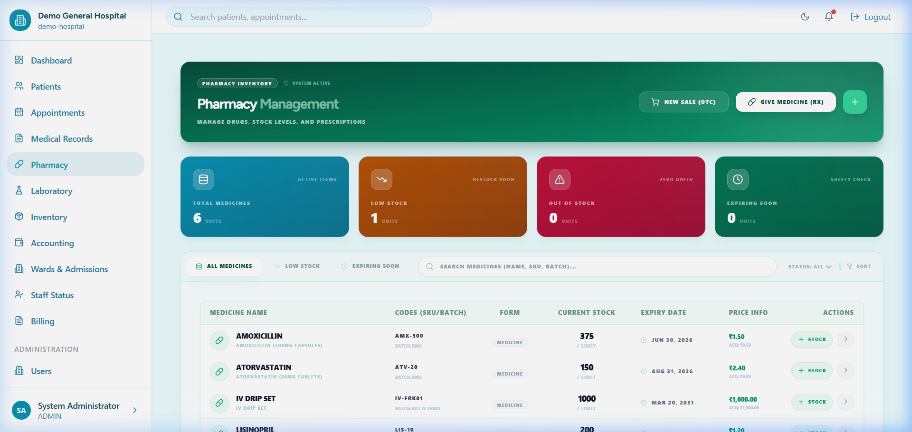
*Secure pharmacy dispensing with row-level locking for safety.*

---

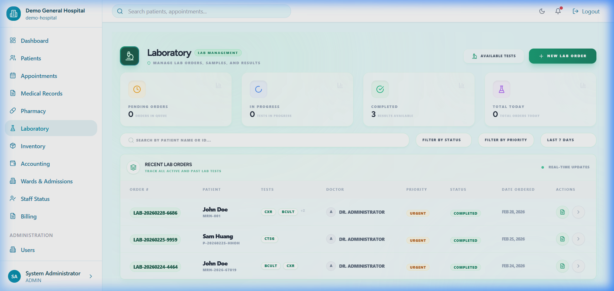
*Integrated LIS with file uploads and diagnostic reporting.*

---

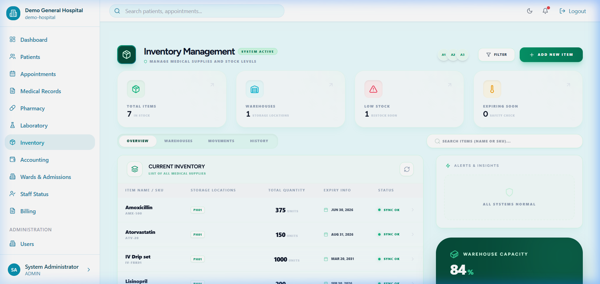
*Batch-level inventory management with expiry tracking.*

---

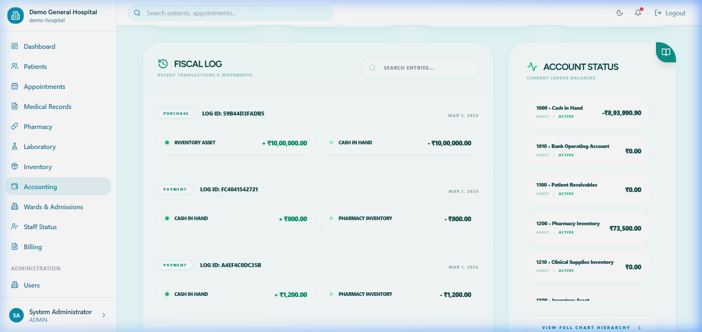
*Hospital accounting and financial oversight.*

---

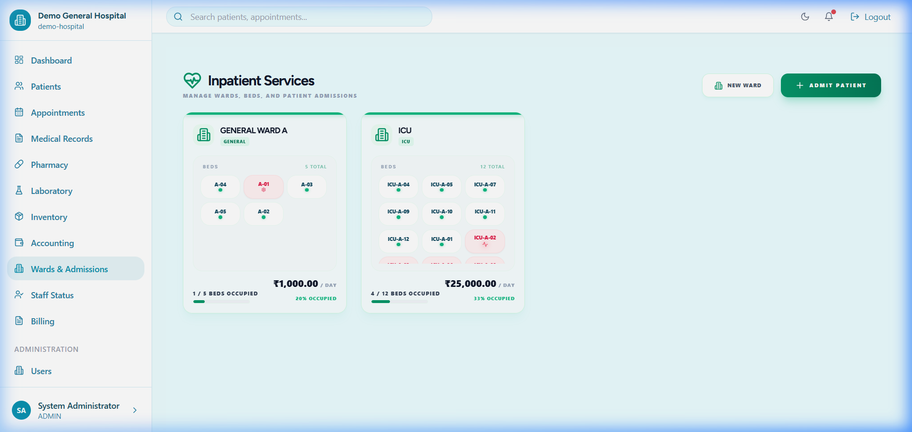
*Inpatient ward management and bed occupancy tracking.*

---

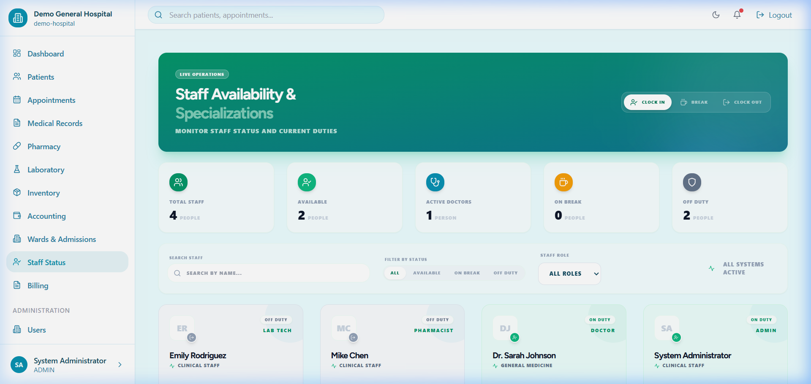
*Real-time staff availability and duty status.*

---

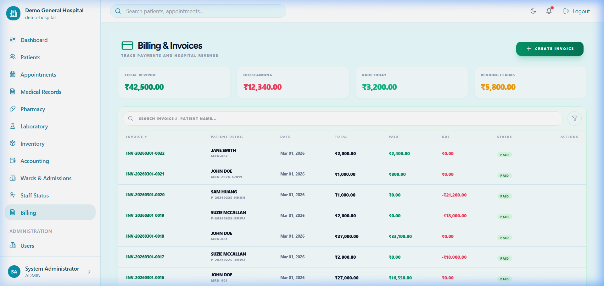
*Professional billing with customizable print-ready invoices.*

---

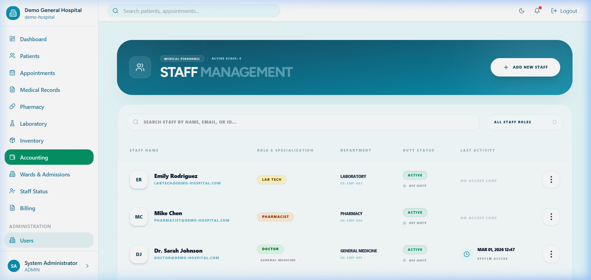
*Advanced RBAC (Role-Based Access Control) for hospital staff.*

---

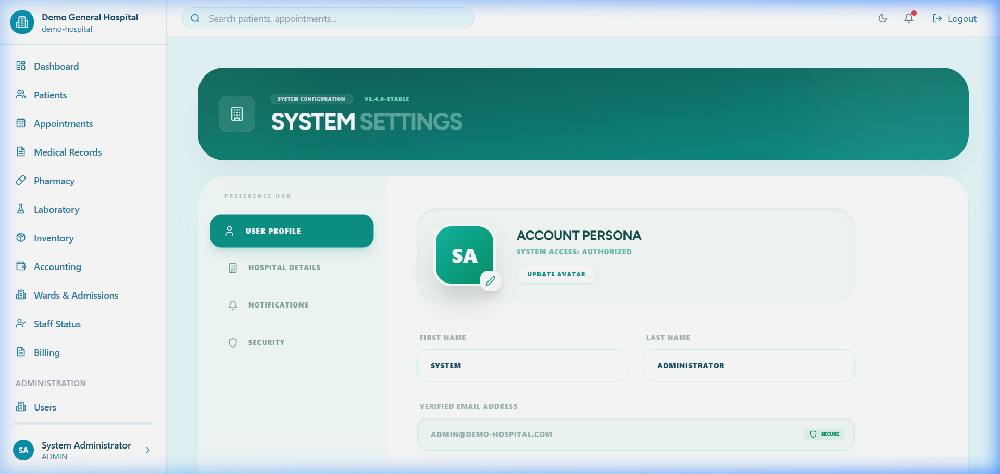
*Global tenant settings and configuration.*

---

## 📐 Architecture Overview

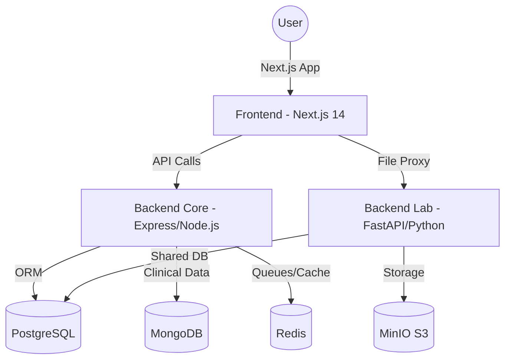

| Layer | Technology | Description |
|-------|-----------|-------------|
| **Frontend** | Next.js 14, Tailwind, Shadcn | Modern, responsive dashboard with strict TypeScript. |
| **Core API** | Node.js, Express, Prisma | Handles business logic, RBAC, and multi-tenancy. |
| **Lab API** | Python, FastAPI | Specialized for file handling, DICOM, and MinIO storage. |
| **Database** | PostgreSQL 16 | Primary relational storage for all hospital entities. |
| **EMR DB** | MongoDB 7 | Scalable storage for unstructured clinical notes and EMR data. |
| **Messaging** | Redis 7 + Bull | Asynchronous processing for stock alerts and notifications. |
| **Object Store**| MinIO | Locally hosted S3-compatible storage for diagnostic images. |

---

## 🚀 Getting Started

If you are looking for technical setup instructions, environment configurations, and deployment guides, please refer to:

👉 **[INSTALL.md](INSTALL.md)**

---

## 🔐 Security & Safety

- **Multi-Tenant Isolation**: Deep-level filtering using `tenantId` in all queries.
- **RBAC**: Role-based access control (Admin, Doctor, Nurse, Pharmacist, Lab Tech).
- **Audit Trails**: Detailed logs of every sensitive mutation.
- **Concurrency Safety**: High-precision pharmacy stock adjustments using atomic transactions.

---

---

## 🆕 Recent Improvements

- **Comprehensive UX Feedback**: Implemented `sonner` toast notifications across all modules (Auth, Wards, Inventory, Lab, EMR, Settings) for real-time success/error feedback.
- **Session Stability**: Resolved premature logout issues by aligning backend cookie `maxAge` with JWT expiration (24 hours).
- **TypeScript Robustness**: Fixed critical type errors in authentication hooks and improved API response typing.

---

## 📄 License
MIT License. Built with ❤️ by the Agentbot Dev Team.
